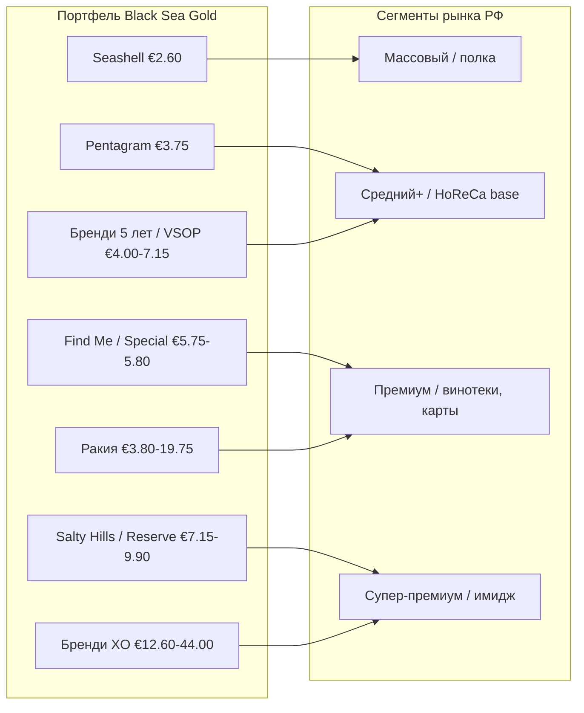

# Раздел 1. Black Sea Gold и потенциал компании

> Задача раздела — показать руководству Black Sea Gold, что у компании есть история,
> терруар, производственная база, международное признание и готовая ценовая
> архитектура портфеля, пригодные для системного входа на российский рынок, и что
> этот портфель закрывает сразу несколько ценовых сегментов РФ. Раздел опирается на
> прайс-лист BSG 2026 (`assets/data/price-list-bsg-2026.csv`) и корпоративный каталог
> Festa (Black Sea Gold, Pomorie).

## 1.1. Профиль и история компании

**Black Sea Gold** («Поморийско злато») — винодельческий и ликёро-водочный завод в
г. Поморие на черноморском побережье Болгарии; одно из старейших винодельческих
предприятий страны с непрерывной историей почти в **100 лет**. Слоган компании —
*Pure Gold from Pomorie*.

Ключевые вехи истории (из корпоративного каталога):

| Год | Событие |
|---|---|
| **1924** | Основание: предприниматели из Помория создают кооператив «Dimyat» — первое виноградарско-винодельческое товарищество |
| **1932** | Построен первый современный винный погреб в городе (сегодня — сердце комплекса винного туризма: отель, ресторан, дегустационный зал, музей; вина Via Pontica) |
| **1950-е** | Завод получает облик современного винодельческого производства |
| **~1970-е** | Создан отдельный корпус на **12 000 дубовых бочек** для выдержки винного дистиллята |
| **1994** | Импортированы **8 оригинальных шарантских перегонных кубов из региона Коньяк (Франция)** — старт производства ракии и бренди высшего качества в Юго-Восточной Европе |
| **2007–2013** | Инвестировано **более €5,5 млн** в строительство микро-винодельни (ручное микровиноделие, лимитированные серии) |

> Вывод: перед инвестором не «ещё один поставщик», а завод с вековой историей,
> собственным туристическим брендом (Via Pontica) и доказанной способностью
> инвестировать в качество (€5,5 млн в микро-винодельню, шарантские кубы из Коньяка).

## 1.2. Терруар и производственная база

- **Более 700 гектаров собственных виноградников** вдоль черноморского побережья —
  один из лучших терруаров Болгарии для белых сортов.
- **Сорта:** Шардоне, Совиньон Блан, Мускат Оттонель, Гевюрцтраминер, Каберне
  Совиньон, Мерло, Сира, Каберне Фран, а также автохтонный фракийский **Мавруд**.
- **География виноградников:** сёла Разбойна, Трояново, Аспарухово, Ражица,
  Зорница, Царево, Зимен, Добриново, Белодол — **песчаные почвы с идеальным
  дренажом**, дающие винам минеральность и утончённость.
- **База дистилляции:** 12 000 дубовых бочек для выдержки дистиллята; 8 шарантских
  кубов; выдержка в специфических бочках (700-л акациевые для линейки Find Me;
  10-тонные бочки из странджанского дуба для премиальной ракии Burgaska 7 лет).
- **Микро-винодельня** для ручного производства лимитированных серий высшего
  качества.

> Практический смысл для проекта РФ: собственный виноградник (а не закупка винограда)
> = контроль качества и себестоимости и устойчивость поставок под контрактные объёмы.
> Наличие свободных мощностей под объёмы РФ — единственный параметр, который стоит
> подтвердить у производителя на этапе контрактации (Раздел 8).

## 1.3. Продуктовый портфель: структура

Портфель BSG для поставок в РФ (прайс 2026) — **50 SKU** в трёх категориях. Цены —
FCA Поморие, EUR, без НДС и акцизов страны назначения.

| Категория | Кол-во SKU | Диапазон цен FCA, € | Объёмы, л |
|---|---:|---:|---|
| Вина (тихие) | 28 | 2.60 – 9.90 | 0.75 (спец. вина 0.5) |
| Бренди Black Sea Gold | 7 | 4.00 – 44.00 | 0.2 / 0.5 / 0.7 |
| Ракия (Pomorie, Burgas) | 13 | 3.80 – 19.75 | 0.5 / 0.7 |
| Специальные вина (Blgovest, аперитив) | 2 | 2.85 – 3.40 | 0.5 |
| **Итого** | **50** | **2.60 – 44.00** | — |

Портфель охватывает диапазон отпускных цен **от €2.60 до €44.00** — это редкое для
одного производителя свойство: он позволяет заходить в разные ценовые сегменты РФ и
разные каналы одним контрактом и одной логистической цепочкой.

## 1.4. Винный портфель: ценовая лестница по сериям

Вина выстроены в чёткую **ценовую лестницу серий** — от входного уровня к
супер-премиуму. Это готовая архитектура ассортимента: не разрозненные позиции, а
управляемый «трейд-ап» покупателя.

| Серия | Позиционирование | Цена FCA, € | SKU | Технология / особенность |
|---|---|---:|---:|---|
| **Seashell** | базовый | 2.60 | 5 | моносортовые, свежие, доступные |
| **Pentagram** | премиальные сухие | 3.75 | 10 | ручной сбор; Шардоне — 3 мес. в калифорнийском дубе, Мерло/Каберне — французский дуб |
| **Special Collection (Stamp)** | коллекционные | 5.80 | 2 | Каберне Совиньон, Мерло |
| **Find Me** | премиум | 5.75 | 6 | выдержка в 700-л акациевых бочках; координаты Помория на этикетке |
| **Salty Hills** | супер-премиум | 7.15 | 3 | купажи (белый, красный, розе) |
| **Special Reserve** | топ | 9.35 – 9.90 | 2 | выдержка в дубе; сигнатурная серия |

Ключевые наблюдения для стратегии:

- **Сильная белая и розовая база** — морской терруар даёт реальное УТП именно в
  белом сегменте, который в РФ растёт быстрее красного.
- **Плотная середина (Pentagram, 10 SKU)** — «рабочая лошадь» для HoReCa и винных
  карт: широкий сортовой выбор в одной цене (€3.75).
- **Есть верх линейки** (Find Me, Salty Hills, Special Reserve) для позиционирования
  бренда и премиальных карт.

## 1.5. Крепкий портфель: бренди и ракия

Крепкое направление — **дифференциатор** от «просто ещё одного винного поставщика»,
опирающийся на шарантские кубы из Коньяка (1994) и десятилетия выдержки.

**Бренди Black Sea Gold** — лестница выдержки в коньячной градации (VS → VSOP → XO):

| Продукт | Выдержка | Цена FCA, € | Объёмы |
|---|---|---:|---|
| Black Sea Gold 5 лет | 5 лет, 40% | 4.00 / 4.55 | 0.5 / 0.7 |
| V.S.O.P. | 40% | 7.15 | 0.7 |
| XO 17 лет | 40% | 12.60 | 0.7 |
| XO 25 лет | 40% | 29.70 | 0.7 |
| XO 33 года | 42% | 13.20 / 44.00 | 0.2 / 0.7 |

Отдельно — коллекционное вино **Brandy Cask Cabernet Sauvignon**: ферментация и
выдержка в французских дубовых бочках, где до этого **30 лет выдерживался винный
бренди** — уникальная технология и история для премиальной полки.

**Ракия Pomorie / Burgas** — нишевый, но уникальный продукт: балканский дистиллят
почти не представлен в РФ, что даёт «право первого хода».

| Линейка | Диапазон FCA, € | Заметные SKU / особенность |
|---|---:|---|
| Pomoriyska (классическая) | 3.80 – 5.00 | Classic, Special, Мускат; классическая болгарская технология |
| Burgaska (классическая и премиум) | 3.80 – 19.75 | Мускат 7 лет (10-т бочки из странджанского дуба), Burgas 63 (Barrel/Pearl/Траминер/12 лет), Alambic |

## 1.6. Международное признание (награды)

Портфель BSG подтверждён медалями авторитетных международных конкурсов
(AWC Vienna, Mundus Vini, Concours Mondial de Bruxelles, Mondial du Rosé,
IWSC London, Grand Prix Vinex, BWSC). Выборка из каталога:

| Продукт | Ключевые награды |
|---|---|
| Каберне Совиньон Special Reserve | Golden Medal **Mundus Vini** 2023 (урожай 2017); 3-е место **BWSC Wine of the Year Bulgaria** 2019; Silver **AWC Vienna** 2013 |
| Мерло Special Reserve | Gold **AWC Vienna** 2019; Silver AWC Vienna 2018 |
| Pentagram Розе Сира | **Grand Gold Medal — Grand Prix Vinex** 2018; Gold **Mondial du Rosé** 2018; Gold Rosé Wine Expo 2019 |
| Find Me Совиньон Блан & Пино Гри | Golden Medal **Concours Mondial de Bruxelles** 2022 (урожай 2020) |
| Brandy Cask Каберне Совиньон | **Concours Mondial de Bruxelles** 2020; Gold **Mundus Vini** 2010; Gold **AWC Vienna** 2017 |
| Ракия Burgaska Мускат 7 лет | Golden Medal **Concours Mondial de Bruxelles — Spirits Selection** 2020; Bronze **IWSC London** 2016 |
| Ракия Pomorie Special | Gold Medal **Spirit Selection by Mondial de Bruxelles** 2016 |

> Практический смысл: награды — готовый аргумент для листинга в сетях и винотеках и
> для HoReCa-карт, снижающий барьер доверия к незнакомому болгарскому бренду в РФ.
> Медали используются в маркетинге (Раздел 7) и в переговорах с байерами (Раздел 4).

## 1.7. Карта портфеля → ценовые сегменты РФ

Портфель BSG проецируется на сегменты российского рынка так (сегментация уточняется
в Разделе 3 по ценам на полке):

Вывод из карты: **один портфель закрывает все четыре сегмента**. Это позволяет
строить вход не от одной позиции, а от сбалансированного набора: «драйвер объёма»
(Seashell/Pentagram) + «драйвер маржи и имиджа» (Find Me/Salty Hills/XO) +
«драйвер уникальности» (ракия).

## 1.8. Практический вывод раздела

1. **Острие входа — белые и розовые вина Pentagram и Seashell**: широкий сортовой
   выбор, конкурентная FCA-цена, опора на морской терруар как реальное УТП,
   подкреплённое медалями (Mondial du Rosé, Concours Mondial de Bruxelles).
2. **Крепкое (бренди коньячной градации на шарантских кубах + уникальная ракия)** —
   дифференциатор, снижающий зависимость от насыщенного винного сегмента и
   открывающий отдельные каналы (алкомаркеты, подарочный сегмент, бар-карты).
3. **Готовая ценовая лестница** уже встроена в прайс — не нужно конструировать
   ассортимент с нуля, нужно выбрать SKU-ядро (Раздел 5) и просчитать его экономику
   (Разделы 6, 9).
4. **История, терруар и награды** — готовый нарратив доверия для российского байера
   и потребителя; это актив маркетинга (Раздел 7), а не то, что нужно создавать.
5. **Единственный открытый параметр** — свободные производственные мощности под
   контрактные объёмы РФ; подтверждается у производителя на этапе контрактации
   (Раздел 8), не блокирует стратегию.

> Связи вперёд: ценовая архитектура §1.4–1.5 — вход в расчёт landed cost (Раздел 6)
> и финмодель (Раздел 9); награды §1.6 — в маркетинг (Раздел 7); сегментная карта
> §1.7 — основа для анализа конкурентов (Раздел 3) и выбора каналов (Раздел 4).
