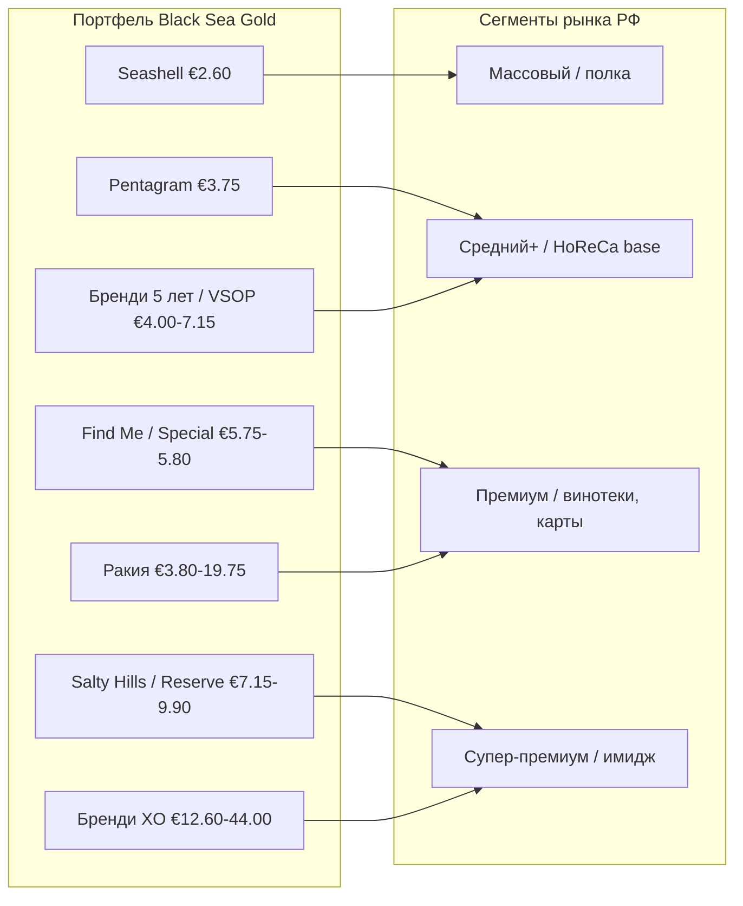

# Раздел 1. Black Sea Gold и потенциал компании

> Задача раздела — показать руководству Black Sea Gold, что у компании есть
> портфель, ценовая архитектура и производственная база, пригодные для системного
> входа на российский рынок, и что этот портфель закрывает сразу несколько ценовых
> сегментов РФ. Раздел опирается на прайс-лист BSG 2026 (`assets/data/price-list-bsg-2026.csv`)
> и проверенные факты; данные, которые должен подтвердить производитель, помечены
> `[уточнить у BSG]`.

## 1.1. Профиль компании

**Black Sea Gold** — винодельческий и ликёро-водочный завод в г. Поморие на
черноморском побережье Болгарии; один из старейших производственных винодельческих
предприятий страны. Компания сочетает три направления в одном портфеле:

- **тихие вина** — белые, розовые, красные, от базовой до супер-премиальной линейки;
- **крепкие напитки** — бренди выдержки от 5 до 33 лет;
- **ракия** — традиционный балканский дистиллят линеек Pomorie и Burgas.

Ключевые природные факторы терруара — **морской климат и известковые почвы**
черноморского побережья, дающие свежие, минеральные, выразительные белые вина, и
собственная база дистилляции для крепкого сегмента.

Параметры, которые необходимо подтвердить у производителя для финальной версии
(влияют на разделы 6, 8, 9):

| Показатель | Значение | Источник |
|---|---|---|
| Год основания завода | `[уточнить у BSG]` | производитель |
| Площадь виноградников, га | `[уточнить у BSG]` | производитель |
| Объём производства, бут./год | `[уточнить у BSG]` | производитель |
| Свободные мощности под РФ | `[уточнить у BSG]` | производитель |
| Ключевые награды (последние 3–5 лет) | `[уточнить у BSG]` / каталог Festa | производитель |
| Наличие устойчивых поставок стекла/тары | `[уточнить у BSG]` | производитель |

> Наличие этих цифр превращает раздел из презентационного в инвестиционный:
> инвестор видит не «известный завод», а конкретную производственную ёмкость под
> проект РФ. До подтверждения используем нейтральные формулировки без вымышленных
> данных.

## 1.2. Продуктовый портфель: структура

Портфель BSG для поставок в РФ (прайс 2026) — **50 SKU** в трёх категориях. Цены —
FCA Поморие, EUR, без НДС и акцизов страны назначения.

| Категория | Кол-во SKU | Диапазон цен FCA, € | Объёмы, л |
|---|---:|---:|---|
| Вина (тихие) | 28 | 2.60 – 9.90 | 0.75 (спец. вина 0.5) |
| Бренди Black Sea Gold | 7 | 4.00 – 44.00 | 0.2 / 0.5 / 0.7 |
| Ракия (Pomorie, Burgas) | 13 | 3.80 – 19.75 | 0.5 / 0.7 |
| Специальные вина (Blgovest, аперитив) | 2 | 2.85 – 3.40 | 0.5 |
| **Итого** | **50** | **2.60 – 44.00** | — |

Портфель охватывает диапазон отпускных цен **от €2.60 до €44.00** — это редкое для
одного производителя свойство: он позволяет заходить в разные ценовые сегменты РФ и
разные каналы одним контрактом и одной логистической цепочкой.

## 1.3. Винный портфель: ценовая лестница по сериям

Вина выстроены в чёткую **ценовую лестницу серий** — от входного уровня к
супер-премиуму. Это готовая архитектура ассортимента: не разрозненные позиции, а
управляемый «трейд-ап» покупателя.

| Серия | Позиционирование | Цена FCA, € | SKU | Состав линейки |
|---|---|---:|---:|---|
| **Seashell** | входной / базовый | 2.60 | 5 | Шардоне, Мускат Оттонель, Розе, Мерло, Каберне Совиньон |
| **Pentagram** | премиальные сухие | 3.75 | 10 | Пино Гри, Траминер, Вионье, Шардоне, Совиньон Блан, Пино Нуар, Мерло, Каберне, Сира, Розе Сира |
| **Special Collection (Stamp)** | коллекционные | 5.80 | 2 | Каберне Совиньон, Мерло |
| **Find Me** | премиум | 5.75 | 6 | Шардоне, Совиньон Блан, СБ&Пино Гри, Розе, Сира&Мерло, Каберне Фран |
| **Salty Hills** | супер-премиум (купажи) | 7.15 | 3 | белый и красный купажи, розе |
| **Special Reserve** | топ (бочковая выдержка) | 9.35 – 9.90 | 2 | Brandy Cask, Arte Ante (Каберне Совиньон) |

Ключевые наблюдения для стратегии:

- **Сильная белая и розовая база.** Морской терруар — конкурентное преимущество
  BSG именно в белом и игристом сегменте, который в РФ растёт быстрее красного.
- **Плотная середина (Pentagram, 10 SKU).** Это «рабочая лошадь» для HoReCa и
  винных карт — широкий сортовой выбор в одной цене (€3.75).
- **Есть верх линейки** (Find Me, Salty Hills, Special Reserve) для позиционирования
  бренда и премиальных карт, не только для полки.

## 1.4. Крепкий портфель: бренди и ракия

Крепкое направление — второй козырь BSG и **дифференциатор от «просто ещё одного
винного поставщика»**.

**Бренди Black Sea Gold** — выстроенная лестница выдержки, аналог коньячной
градации (VS → VSOP → XO), что понятно российскому покупателю:

| Продукт | Выдержка | Цена FCA, € | Объёмы |
|---|---|---:|---|
| Black Sea Gold 5 лет | 5 лет, 40% | 4.00 / 4.55 | 0.5 / 0.7 |
| V.S.O.P. | 40% | 7.15 | 0.7 |
| XO 17 лет | 40% | 12.60 | 0.7 |
| XO 25 лет | 40% | 29.70 | 0.7 |
| XO 33 года | 42% | 13.20 / 44.00 | 0.2 / 0.7 |

**Ракия Pomorie / Burgas** — нишевый, но уникальный продукт: балканский дистиллят
почти не представлен в РФ, что даёт «право первого хода» и историю бренда
(муската, барреловые и многолетние версии — Burgas 63 линейка до 12 лет).

| Линейка | Диапазон FCA, € | Заметные SKU |
|---|---:|---|
| Pomorie | 3.80 – 5.00 | Classic, Special, Мускат |
| Burgas | 3.80 – 19.75 | Мускат 7 лет, Burgas 63 (Barrel/Pearl/Траминер/12 лет), Alambic |

## 1.5. Карта портфеля → ценовые сегменты РФ

Портфель BSG проецируется на сегменты российского рынка так (сегментация уточняется
в Разделе 3 по ценам на полке):

Вывод из карты: **один портфель закрывает все четыре сегмента**. Это позволяет
строить вход не от одной позиции, а от сбалансированного набора: «драйвер объёма»
(Seashell/Pentagram) + «драйвер маржи и имиджа» (Find Me/Salty Hills/XO) +
«драйвер уникальности» (ракия).

## 1.6. Практический вывод раздела

1. **Острие входа — белые и розовые вина Pentagram и Seashell**: широкий сортовой
   выбор, конкурентная FCA-цена, опора на морской терруар как реальное УТП.
2. **Крепкое (бренди с понятной градацией выдержки + уникальная ракия)** —
   дифференциатор, снижающий зависимость от насыщенного винного сегмента и
   открывающий отдельные каналы (алкомаркеты, подарочный сегмент, бар-карты).
3. **Готовая ценовая лестница** уже встроена в прайс — не нужно конструировать
   ассортимент с нуля, нужно выбрать SKU-ядро (Раздел 5) и просчитать его экономику
   (Разделы 6, 9).
4. **Ограничение, которое надо закрыть:** производственные факты (`[уточнить у BSG]`)
   — без них инвестиционная часть опирается на допущения. Это первый запрос к
   производителю параллельно с работой над Разделами 2–4.

> Связи вперёд: ценовая архитектура из §1.3–1.4 — вход в расчёт landed cost
> (Раздел 6) и финмодель (Раздел 9); сегментная карта §1.5 — основа для анализа
> конкурентов (Раздел 3) и выбора каналов (Раздел 4).
