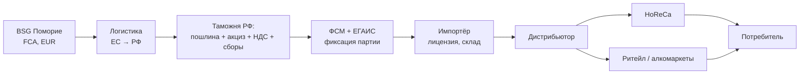

# Раздел 2. Российский рынок алкогольной продукции

> Задача раздела — дать инвестору объективную картину рынка, на который выходит BSG:
> его размер и динамику, роль импорта, и — главное — **регуляторно-фискальный
> контур** (ЕГАИС, акцизы, ввозные пошлины на вино из ЕС, ограничения рекламы и
> онлайн-продаж). Все ключевые ставки верифицированы по первоисточникам 2024–2025 гг.
> и зафиксированы в сквозных допущениях (`README.md`); от них считается финмодель
> (Раздел 9). Данные для уточнения помечены `[проверить]`.

## 2.1. Объём и динамика рынка вина

Российский рынок тихих и игристых вин — крупный и, до 2025 года, растущий:

| Показатель (2024) | Значение |
|---|---|
| Объём рынка (тихие + игристые) | **92,6 млн дал** (+5% к 2023) |
| Потребление вина | ~84 млн дал (максимум за 3 года) |
| Доля импорта в объёме | **44,5%** |
| Структура: тихие / игристые | 74% / 26% |
| Отечественное производство | 51,3 млн дал (+14%): тихие 32,6, игристые 17,6, крепленые 1,1 |

**Ключевой тренд 2025 года — импортозамещение под давлением пошлин.** За 9 месяцев
2025 г. отечественное производство выросло на 5,7% (до 46,6 млн дал), а **импорт
сократился более чем на четверть — до 23,6 млн дал**. Импорт вина в литрах за
январь–октябрь 2024 г. уже падал на ~33% год к году.

> Вывод для BSG: рынок большой, но импортная ниша **сжимается под действием
> фискальной политики и господдержки отечественного вина**. Значит, вход должен
> строиться не на ценовой конкуренции в масс-сегменте (где импорт вытесняется), а на
> **дифференциации** — терруар, награды, крепкий портфель, премиальное
> позиционирование (см. §2.7 и Раздел 1).

## 2.2. Структура импорта и страны-поставщики

Топ-поставщики импортного вина в РФ (2024):

| Страна | Доля импорта | Статус по пошлинам |
|---|---:|---|
| Италия | 29% (~15 млн дал) | ЕС — **повышенные пошлины** |
| Грузия | 25% (~13 млн дал) | «дружественная» — **пошлины не применяются** |
| Испания | 10% (~6 млн дал) | ЕС — повышенные пошлины |
| Португалия | ~5% | ЕС — повышенные пошлины |
| Франция | ~5% (выбывает из топ-5) | ЕС — повышенные пошлины |

**Главный бенефициар фискальных изменений — Грузия** (+10 п.п. доли): её вина не
попадают под повышенные пошлины, и на неё пришлась четверть всего импорта; в тихих
винах Грузия — абсолютный лидер. Италия удерживает первенство преимущественно за
счёт игристых.

> Стратегический факт для проекта: **Болгария — страна ЕС и относится к
> «недружественным»**, то есть попадает в тот же пошлинный режим, что Италия/Испания,
> и не имеет ценовой льготы Грузии. Это центральный вызов входа — прямо
> адресуется в стратегии (Раздел 5) и рисках (Раздел 10). Ответ — не конкурировать
> ценой с Грузией в базовом сегменте, а играть на терруаре, наградах и уникальном
> крепком портфеле.

**Крепкий сегмент (бренди/коньяк):** отдельный крупный рынок, где доминируют
армянский коньяк (Ararat, Ной), российский бренди/коньяк (Кизляр, Дербент) и
грузинский. Балканская ракия в РФ практически не представлена — «право первого хода»
для BSG. Точные объёмы сегмента — `[проверить]` при детализации Раздела 3.

## 2.3. Регуляторный контур: как устроен рынок

Импорт и оборот алкоголя в РФ жёстко зарегулированы. Ключевые элементы:

| Элемент | Суть | Значение для проекта |
|---|---|---|
| **ЕГАИС** | Единая гос. автоматизированная информационная система учёта; фиксирует каждую партию от производства/импорта до розницы | Обязательна; импортёр должен быть подключён |
| **Лицензирование** | Лицензия на импорт и на оптовую торговлю алкоголем (регулятор — Росалкогольтабакконтроль) | Требуется у российского партнёра-импортёра |
| **ФСМ** | Федеральные специальные марки на каждую бутылку импортного алкоголя | Наносятся до ввоза; стоимость и учёт — в landed cost |
| **Декларирование** | Гос. регистрация, декларации соответствия (ТР ТС/ЕАЭС), маркировка на русском | Подготовка документации и этикетки под РФ |
| **Таможенное оформление** | Пошлина + акциз + НДС + сборы при ввозе | См. §2.4 |

> Практический смысл: BSG не выходит на рынок напрямую — вход технически возможен
> **только через российского лицензированного импортёра**, подключённого к ЕГАИС.
> Это определяет коммерческую модель (Раздел 6) и роль КВИС ТРЕЙД / партнёра
> (Раздел 5).

## 2.4. Фискальная нагрузка (верифицировано)

### Акцизы (Налоговый кодекс РФ; закон подписан 28.11.2025)

| Категория | 2025 | 2026 | 2027 | 2028 |
|---|---:|---:|---:|---:|
| Вино тихое, руб/л продукции | 113 | **148** | 154 | 160 |
| Игристое, руб/л продукции | 125 | **160** | 166 | 173 |
| Крепкое (этиловый спирт), руб/л **безводного спирта** | 740 | **824** | 857 | 891 |

Важно для расчётов: акциз на вино/игристое — **на литр продукции**; на крепкое —
**на литр 100% спирта** (для бренди 40% и бутылки 0,7 л акциз 2026 = 824 × 0,40 ×
0,7 ≈ **231 руб/бут.**). Акцизы индексируются выше инфляции — тренд роста нагрузки
заложен до 2028 г.

### Ввозные пошлины на алкоголь из «недружественных» стран (включая Болгарию)

| Категория | Ставка (2025) | Минимум | История |
|---|---|---|---|
| Вино тихое и игристое | **25%** таможенной стоимости | не менее **$2 / литр** | 2023: 20%/$1.5 → авг. 2024: 25%/$2 |
| Крепкое (>9%, вкл. бренди/ракию) | **20%** таможенной стоимости | не менее **€3 / литр 100% спирта** | введено в 2024 |

**Эффект «минимальной ставки» бьёт по дешёвому вину сильнее всего.** Для вина
Seashell (FCA €2.60, 0,75 л): 25% = €0.65, но минимум $2/л ≈ €1.4 за бутылку —
т.е. фактическая пошлина ~50% стоимости. Для премиального вина (€7–9) работает
адвалорная ставка 25%, доля пошлины ниже. Эксперты прямо отмечают: рост пошлин
**больнее всего для недорогого импортного алкоголя**.

> Это — важнейший практический вывод раздела для ассортиментной стратегии:
> **экономика входа лучше в средних и премиальных сериях (Pentagram и выше), чем в
> базовом Seashell**. Полный расчёт landed cost по SKU — Раздел 6, сценарии — Раздел 9.

## 2.5. Немонетарные ограничения

| Ограничение | Суть | Влияние на проект |
|---|---|---|
| **Запрет рекламы алкоголя** (ФЗ-38 «О рекламе», ст. 21) | Запрещена реклама в большинстве каналов (ТВ, наружная, интернет и др.) | Маркетинг строится на B2B, HoReCa, дегустациях, POS, PR — не на прямой рекламе (Раздел 7) |
| **Ограничение онлайн-продаж** | Дистанционная розничная продажа алкоголя запрещена | E-com — только витрина/самовывоз/бронирование; полноценного онлайн-канала нет (Раздел 4) |
| **МРЦ** | Минимальные розничные цены на крепкое | Нижняя граница цены бренди/ракии на полке — `[проверить]` ставка |
| **Протекционизм** (ФЗ-468 «О виноградарстве и виноделии») | Господдержка «вина России», приоритет отечественного на полке и в господдержке | Усиливает давление на импорт; ещё один аргумент за дифференциацию, не за ценовую войну |
| **Ограничения времени/мест продажи** | Региональные ограничения розничной продажи по времени | Учитывается в канальной стратегии (Раздел 4) |

## 2.6. Путь импортной бутылки: от границы до полки

Каждое звено добавляет стоимость и требования — это каркас коммерческой модели
(Раздел 6) и основа расчёта конечной цены на полке.

## 2.7. Практический вывод раздела

1. **Рынок большой (92,6 млн дал), но импортная ниша сжимается** под давлением
   пошлин и господдержки отечественного вина. Вход — через дифференциацию, не через
   цену.
2. **Болгария в «недружественном» пошлинном режиме** (25%/$2 на вино, 20%/€3 на
   крепкое) — нет ценовой льготы Грузии. Это принимается как данность и обходится
   позиционированием (терруар, награды, крепкий портфель).
3. **Фискальная арифметика смещает фокус к среднему и премиальному сегменту:**
   минимальная пошлина делает дешёвое вино невыгодным — приоритет Pentagram и выше,
   а не Seashell.
4. **Крепкий портфель — недооценённая возможность:** ракия почти отсутствует на
   рынке, бренди конкурирует в понятной для РФ категории.
5. **Вход только через лицензированного импортёра в ЕГАИС** — определяет модель
   партнёрства BSG × КВИС ТРЕЙД (Разделы 5–6).
6. **Маркетинг — без прямой рекламы**, на B2B/HoReCa/PR (Раздел 7).

> Связи вперёд: ставки §2.4 → landed cost (Раздел 6) и финмодель (Раздел 9);
> структура импорта §2.2 → конкуренты (Раздел 3); ограничения §2.5 → каналы
> (Раздел 4) и маркетинг (Раздел 7); «недружественный» статус → риски (Раздел 10).

## Источники

- Акцизы 2025–2028: [РИА Новости, 28.11.2025](https://ria.ru/20251128/putin-2058450221.html);
  [ДП, 29.09.2025](https://www.dp.ru/a/2025/09/29/vinnij-akciz-v-rossii-s-2026);
  [Агроэксперт](https://agroexpert.press/zakonodatelstvo/akczizy-na-alkogol-povyshayutsya-s-2025-goda-na-10-31-proekt-popravok-v-nk/)
- Ввозные пошлины: [Ведомости, 25.07.2023](https://www.vedomosti.ru/economics/articles/2023/07/25/986871-rossiya-povisila-poshlini-na-import-vin);
  [РБК, 01.08.2024](https://www.rbc.ru/business/01/08/2024/66ab64df9a79477b3ae2bdbd);
  [Российская газета, 02.08.2024](https://rg.ru/2024/08/02/eksperty-rost-vvoznyh-poshlin-bolshe-skazhetsia-na-inostrannom-nedorogom-alkogole.html)
- Объём рынка и импорт: [Винодельческий Союз, 24.02.2025](https://vin-souz.ru/2025/02/24/);
  [Российская газета, 13.11.2025](https://rg.ru/2025/11/13/v-rossii-uskorilis-temy-importozameshcheniia-vina.html);
  [WineRetail](https://wineretail.info/znaniya/2024/11/21/wr-import-vina-v-rossiyu.-doli-top-5-stran-postavshhikov/)
