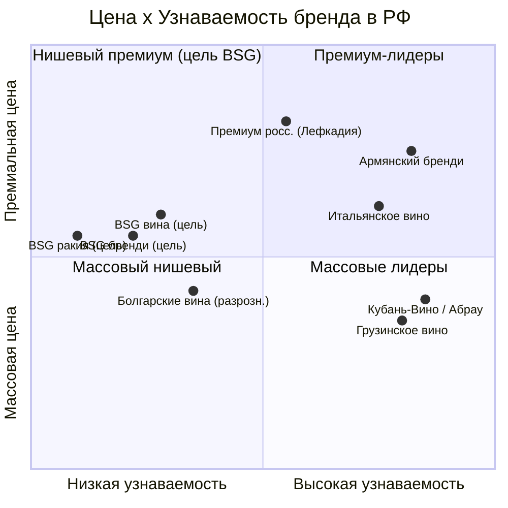

# Раздел 3. Анализ конкурентов

> Задача раздела — определить, с кем конкурирует BSG в каждой релевантной категории,
> по какой цене и позиционированию, и где на рынке есть **свободные ниши**. Порядок:
> методология сравнения → импортное вино → отечественное вино → болгарские вина в РФ
> → бренди → ракия и дистилляты → карта позиционирования → свободные ниши и выводы.
> Розничные цены даны ориентировочно (розница 2025, 0,75 л / 0,7 л), для точной
> привязки к полке помечены `[проверить]`; расчёт ожидаемой полки BSG — в Разделе 6.

## 3.1. Методология сравнения

Конкуренты сопоставляются по четырём осям, важным для входа:

1. **Цена на полке** (розничный диапазон, ₽).
2. **Сегмент** (массовый / средний / премиум / супер-премиум).
3. **Канал** (сети, алкомаркеты, винотеки, HoReCa).
4. **Источник силы** (цена, узнаваемость, терруар, господдержка, дистрибуция).

Задача — не «победить всех», а найти позицию, где сила BSG (терруар, награды,
крепкий портфель, болгарское происхождение) встречает наименьшее сопротивление.

## 3.2. Конкуренты в вине: импорт

| Происхождение | Розница, ₽ (0,75 л) | Сила | Уязвимость |
|---|---|---|---|
| **Грузия** (лидер тихих) | ~500–1 000 | нет повышенных пошлин, высокая узнаваемость, «полусладкое» наследие | слабее в сухих белых/розе европейского стиля |
| **Италия** (лидер игристых) | ~700–2 000+ | бренд «Италия», игристые (Просекко) | повышенные пошлины 25%, дорожает |
| **Испания** | ~600–1 500 | объём, узнаваемость | −4 п.п. доли, вытесняется |
| **Новый Свет / ЮАР / Чили** | ~700–1 500 | цена/качество | логистика, узнаваемость ниже |

**Вывод по импорту:** прямая ценовая борьба с Грузией в тихих винах бесперспективна
(у неё пошлинная льгота). Но грузинские вина сильны в полусладких и красных; **сухие
белые и розе европейского стиля с терруарной историей — относительно свободная
поляна**, и это ровно сильная сторона BSG (морской терруар, награды за розе и белые).

## 3.3. Конкуренты в вине: отечественное производство

Отечественное вино — главный структурный конкурент (растёт, пользуется
господдержкой ФЗ-468, вытесняет импорт с полки):

| Производитель | Объём 2024 | Выручка | Ключевые бренды | Сегмент |
|---|---:|---:|---|---|
| **Кубань-Вино** (№1) | 6,9 млн дал (~100 млн бут.) | 16,5 млрд ₽ | Chateau Tamagne, Aristov, «Высокий берег» | массовый–средний |
| **Абрау-Дюрсо** | 4,9 млн дал | 14,2 млрд ₽ | Абрау-Дюрсо (игристое №1 в РФ) | средний–премиум |
| **Фанагория** | 2,75 млн дал | 8,6 млрд ₽ | Фанагория, Cru Lermont | массовый–средний |

Топ-компании дают ~60% всего производства РФ. Розница массового отечественного вина
— ~400–800 ₽; премиальные российские линейки (Лефкадия, Красностоп, топ-Фанагория) —
1 500–3 500+ ₽.

**Вывод по отечественному:** в массовом сегменте (до ~700 ₽) конкурировать с
субсидируемым отечественным вином импортёру из ЕС невыгодно (пошлины + господдержка
против). Зона BSG — **выше массового отечественного**, где решает не цена, а качество,
происхождение и награды (средний+ и премиум, ~800–2 000 ₽ полка).

## 3.4. Болгарские вина в России (прямой контекст)

Болгарское вино **известно российскому потребителю и широко представлено** в
специализированной рознице (Декантер, WineStyle, BestWine24, АлкоПлаза и др.):

| Бренд | Позиционирование | Розница, ₽ |
|---|---|---|
| Minkov Brothers (серия Cycle) | средний, моносортовые | ~600–1 200 |
| Castra Rubra | средний–премиум, красные | ~900–2 000 |
| Suhindol (Tamyanka, Cab Sauv) | массовый–средний | ~450–900 |
| Logodaj Selection | средний | ~700–1 400 |

Общий диапазон болгарских вин в РФ: **363–3 631 ₽** за 0,75 л, вход ~450–469 ₽.

**Двойственный вывод — это и союзник, и вызов:**
- *Плюс:* «болгарское вино» — не требует объяснения категории, есть доверие и
  ценовое восприятие «достойно за разумные деньги».
- *Минус/возможность:* болгарское присутствие **фрагментировано, без сильного
  премиального бренда-лидера**. Ни один болгарский дом не занял позицию «эталонной
  премиальной Болгарии» в РФ. **Именно эту позицию может занять BSG** — с историей
  (1924), терруаром, наградами и полным портфелем (вино + бренди + ракия), чего нет у
  разрозненных конкурентов.

## 3.5. Конкуренты в бренди

Сегмент бренди/коньяка — где у BSG крепкий портфель и где сложилось «окно» (Раздел 2):

| Группа | Примеры / бренды | Розница, ₽ (0,7 л) | Статус |
|---|---|---|---|
| **Армянский коньяк** (лидер импорта, ~60%) | Арарат, Ной, Great Valley | ~800–4 000+ | нестабилен: запреты Роспотребнадзора, логистика, МРЦ |
| **Российский бренди/коньяк** | Кизляр, Дербент, Старейшина, Трофейный | ~500–1 500 | зависит от импортного дистиллята |
| **Грузинский** | Сараджишвили, «Асканели» | ~900–2 500 | растёт вместе с грузинским импортом |
| **Западный (виски/коньяк как альтернатива)** | — | 1 500+ | дорожает, часть брендов ушла |

**Вывод по бренди:** массовый низ (до ~700 ₽) закрыт российским бренди на импортном
спирте; премиальный верх (Ахтамар, Ной выдержанные) — армянский, но он нестабилен.
**Средне-премиальная зона ~1 000–2 500 ₽ уязвима**: доминирующий армянский поставщик
под давлением, а альтернатив с собственным полным циклом и наградами мало. Бренди BSG
(шарантские кубы, выдержка, медали Concours Mondial de Bruxelles / Mundus Vini) —
органично встаёт именно сюда, честно позиционируясь как **бренди**, а не «коньяк».

## 3.6. Конкуренты в ракии и виноградных дистиллятах

Прямых конкурентов в категории «ракия» в РФ практически нет. Косвенные:

| Категория | Присутствие | Отношение к ракии BSG |
|---|---|---|
| Чача (Грузия) | растёт | ближайший аналог по восприятию; «прокладывает дорогу» дистиллятам |
| Граппа (Италия) | нишевый премиум HoReCa | образец премиального дижестива, ~1 500–4 000 ₽ |
| Сливовица / фруктовые бренди | эпизодически | подтверждают интерес к «региональным» дистиллятам |

**Вывод по ракии:** конкуренция почти отсутствует — это не «занятая ниша», а
**незанятая категория**. Риск не в конкурентах, а в необходимости объяснять продукт
(работа с HoReCa/сомелье). Первый системный игрок получает роль категорийного
эталона.

## 3.7. Карта позиционирования

Карта показывает: BSG входит в **квадрант «нишевый премиум»** (низкая пока
узнаваемость, средне-премиальная цена). Стратегическая задача маркетинга (Раздел 7) —
двигать бренд **вправо** (рост узнаваемости) при удержании премиального
позиционирования, не сваливаясь в массовый ценовой квадрант, где доминируют
субсидируемое отечественное вино и льготная Грузия.

## 3.8. Свободные ниши и выводы для BSG

Четыре относительно свободные ниши, где сила BSG встречает слабое сопротивление:

1. **Сухие белые и розе европейского стиля с терруаром** — грузинский лидер здесь
   слаб, отечественное не имеет морского терруара; опора — награды за розе/белые.
2. **Средне-премиальный бренди (~1 000–2 500 ₽)** — «окно» из-за нестабильности
   армянского коньяка; BSG предлагает полный цикл + награды.
3. **Ракия как новая категория** — конкурентов нет; роль эталона + премиальный
   HoReCa-канал.
4. **Позиция «эталонная премиальная Болгария»** — болгарское присутствие
   фрагментировано, лидера нет; BSG может консолидировать восприятие вокруг себя.

**Общий вывод:** BSG не должен конкурировать «в лоб» по цене ни с Грузией, ни с
субсидируемым отечественным вином, ни с массовым российским бренди. Выигрышная
позиция — **нишевый премиум с дифференциацией** (терруар, награды, полный портфель
вино+бренди+ракия, болгарская история), где перечисленные конкуренты либо
отсутствуют, либо уязвимы.

> Связи вперёд: свободные ниши §3.8 → стратегия выхода и выбор SKU-ядра (Раздел 5);
> ценовые зоны конкурентов §3.2–3.6 → расчёт полки и позиционирование цены
> (Раздел 6); карта §3.7 → задачи маркетинга по росту узнаваемости (Раздел 7).

## Источники

- Отечественные производители: [vino.ru — крупнейшие винодельни 2025](https://vino.ru/novosti/kolonki/krupneyshie-vinodelni-rossii-2025/);
  [Kommersant — Абрау-Дюрсо лидер игристого](https://www.kommersant.ru/doc/7313780);
  [РБК Кубань — топ-30](https://kuban.rbc.ru/krasnodar/freenews/68342e939a7947f951202949)
- Болгарские вина в РФ (бренды, цены): [WineStyle](https://winestyle.ru/wine/bulgaria/);
  [Decanter](https://decanter.ru/wine/bulgaria); [BestWine24](https://bestwine24.ru/vino/smf/region-is-bolgariya/)
- Бренди/коньяк: см. источники Раздела 2 (Logistics.ru, Retail.ru, Ведомости).
