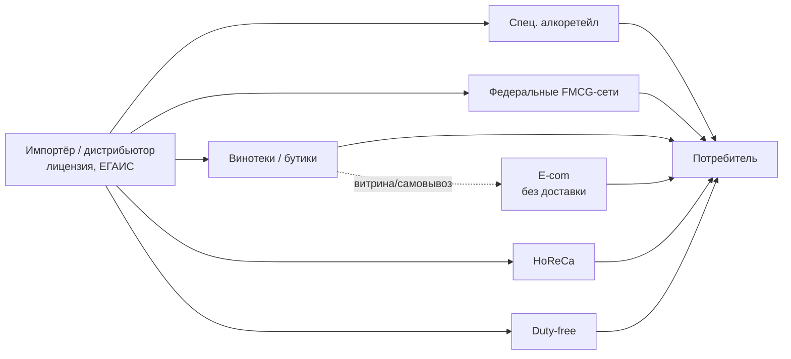

# Раздел 4. Анализ каналов продаж

> Задача раздела — разобрать каналы сбыта алкоголя в РФ (охват, маржинальность,
> барьер входа, пригодность для портфеля BSG) и выстроить их **приоритет для входа**.
> Порядок: карта каналов → специализированный алкоретейл → федеральные сети →
> винотеки и премиальные бутики → HoReCa → duty-free → e-commerce → сравнительная
> матрица и приоритизация. Приоритет каналов согласован с позиционированием «нишевый
> премиум» из Раздела 3 (не ценовая война) и раскрывается по времени в Разделе 8.

## 4.1. Карта каналов

Импортный алкоголь доходит до потребителя через российского импортёра/дистрибьютора
и далее — по каналам продаж (напомним: прямой ввоз и онлайн-розница недоступны, см.
Раздел 2). Основные каналы:

Два измерения выбора канала: **объём** (сети, алкоретейл) против **маржи и имиджа**
(винотеки, HoReCa). Стратегия BSG отдаёт приоритет второму на старте и первому — по
мере роста узнаваемости.

## 4.2. Специализированный алкоретейл (алкомаркеты)

Доминирующий канал продаж алкоголя в РФ по числу точек:

| Сеть | Магазинов (2024–25) | Группа | Профиль |
|---|---:|---|---|
| **Красное & Белое** | 20 527 | Mercury Retail | массовый, лидер по охвату |
| **Бристоль** | ~7 000+ | Mercury Retail | массовый |
| **ВинЛаб** | 2 041 (+23%) | Novabev Group | средний+, винный акцент, растёт |
| Ароматный мир, Отдохни, Градусы | тысячи точек | разные | средний, винная специализация |

Порядка **70 000 крупных розничных точек дают ~¾ всех продаж вина**. КиБ и Бристоль —
это объём, но массовый и ценочувствительный сегмент (не целевой для премиума BSG на
старте). **ВинЛаб и «Ароматный мир»** — более винные и премиальные по ассортименту,
это релевантный канал для среднего+ портфеля BSG (Pentagram, Find Me, бренди).

## 4.3. Федеральные FMCG-сети

| Сеть | Форматы | Релевантность для BSG |
|---|---|---|
| X5 Group | Пятёрочка, Перекрёсток, Чижик | «Перекрёсток» — премиальные полки, целевой для среднего+ |
| Магнит | «у дома», «Магнит Семейный» | массовый; премиальные форматы точечно |
| Лента, Ашан, Метро | гипер/cash&carry | Метро — важен для HoReCa-закупок и опта |

FMCG-сети дают максимальный охват, но: жёсткие условия листинга (входные бонусы,
ретро-бонусы, промо-обязательства), высокая ценовая конкуренция с отечественным вином
и требование объёма/маркетинга. **Для BSG — канал второй волны** (после набора
узнаваемости), с фокусом на премиальные форматы («Перекрёсток»), а не на дискаунтеры.

## 4.4. Винотеки и премиальные бутики

| Игрок | Профиль | Значение для BSG |
|---|---|---|
| SimpleWine (Simple Group) | крупнейшая премиальная винотека + дистрибуция | эталонный премиальный листинг, витрина бренда |
| Fort, La Cave, Декантер | премиальные бутики/дистрибуция | нишевый премиум, экспертный канал |
| WineStyle, BestWine24 | онлайн-витрина + офлайн | где уже представлены болгарские вина (Раздел 3) |

Это **канал первой волны** для BSG: премиальное окружение, экспертная аудитория,
готовность объяснять терруар и происхождение, отсутствие ценовой войны. Именно здесь
болгарские вина уже присутствуют — BSG заходит в знакомую потребителю среду и
претендует на роль премиального болгарского лидера (Раздел 3, §3.4).

## 4.5. HoReCa (рестораны, бары, отели)

Ключевой канал для **дифференцированного портфеля** BSG (терруар, награды, ракия):

- **Винные карты ресторанов** — премиальные вина (Find Me, Salty Hills, Special
  Reserve), розе и белые под гастрономию.
- **Бар-карты** — бренди (VSOP, XO) как дижестив; **ракия как аперитив/дижестив** —
  уникальное предложение, которого нет у конкурентов (Раздел 3, §3.6).
- **Отели и премиальный сегмент** — имиджевое присутствие, дегустации.

Плюсы HoReCa: высокая маржа, формирование имиджа бренда, «право на историю» (сомелье
доносит терруар и награды), **низкий барьер на одну точку** (нет входных бонусов
уровня сетей). Минус: продажи «по точкам», нужен полевой торговый ресурс и работа с
сомелье. **Для BSG — приоритетный канал первой волны** вместе с винотеками.

## 4.6. Duty-free и специальные каналы

- **Duty-free** (аэропорты, погранпереходы) — премиальный и подарочный сегмент:
  бренди XO, ракия премиум, подарочные наборы. Нишевый объём, высокая маржа и имидж.
- **Корпоративные подарки / B2B-gifting** — сезонный канал для бренди и наборов.

Не драйвер объёма, но усиливает премиальное позиционирование и монетизирует верх
портфеля.

## 4.7. E-commerce

**Прямая онлайн-продажа алкоголя в РФ запрещена** (Раздел 2). Доступные форматы:
- **витрина + самовывоз/бронирование** (ВинЛаб, WineStyle, Simple и др.);
- контентная/имиджевая онлайн-presence (карточки, рейтинги, экспертные обзоры) —
  влияет на выбор, но не является каналом прямых продаж.

Роль для BSG — **поддерживающая**: онлайн-витрина в премиальных ресурсах усиливает
офлайн-каналы и узнаваемость, но плана «продавать онлайн» нет (законодательный
барьер).

## 4.8. Сравнительная матрица и приоритизация

| Канал | Охват | Маржа | Барьер входа | Имидж | Пригодность для SKU BSG |
|---|---|---|---|---|---|
| Спец. алкоретейл (масс.: КиБ, Бристоль) | очень высокий | низкая | средний | низкий | Seashell/Pentagram — не приоритет старта |
| Спец. алкоретейл (винный: ВинЛаб, Ар. мир) | высокий | средняя | средний | средний | Pentagram, Find Me, бренди |
| Федеральные сети (Перекрёсток) | высокий | низкая–средняя | высокий | средний | средний+ вино — 2-я волна |
| Винотеки/бутики (Simple, Fort) | средний | высокая | низкий | высокий | Find Me, Salty Hills, Reserve, бренди |
| HoReCa | средний | высокая | низкий (на точку) | очень высокий | весь портфель, особенно ракия и премиум |
| Duty-free / gifting | низкий | высокая | средний | высокий | бренди XO, ракия премиум, наборы |
| E-com (витрина) | — | — | низкий | средний | поддержка, не прямые продажи |

**Приоритизация входа для BSG:**

1. **Волна 1 (имидж и маржа):** HoReCa + премиальные винотеки/бутики (Simple, Fort,
   Декантер). Задача — построить узнаваемость и «право на премиум», монетизировать
   верх портфеля и ракию.
2. **Волна 2 (объём в целевом сегменте):** винный алкоретейл (ВинЛаб, «Ароматный
   мир») — Pentagram, Find Me, бренди среднего сегмента.
3. **Волна 3 (масштаб):** премиальные форматы федеральных сетей («Перекрёсток») по
   мере роста узнаваемости.
4. **Постоянно:** duty-free/gifting для верха портфеля; e-com-витрина как поддержка.

> Вывод: последовательность «HoReCa/винотеки → винный алкоретейл → сети» позволяет
> входить **без больших входных бюджетов на старте**, накапливая узнаваемость там, где
> ценится история и качество, и только затем — в объёмные каналы. Это снижает
> инвестиционный риск (Раздел 9) и синхронизировано с дорожной картой 36 месяцев
> (Раздел 8).

> Связи вперёд: приоритет каналов §4.8 → стратегия выхода (Раздел 5) и план 36 мес.
> (Раздел 8); маржа по каналам → коммерческая модель (Раздел 6) и финмодель
> (Раздел 9); работа с HoReCa/сомелье → маркетинг (Раздел 7).

## Источники

- Алкоретейл (число магазинов, динамика): [Retail.ru — сети 2024](https://www.retail.ru/articles/kak-rosli-seti-v-2024-godu-bespretsedentnye-tempy-krupneyshikh/);
  [Retail.ru — КиБ и Бристоль](https://www.retail.ru/news/infoline-krasnoe-beloe-i-bristol-po-itogu-goda-otkroyut-rekordnye-4-5-tysyachi-m-28-dekabrya-2023-236392/);
  [New-Retail — ВинЛаб](https://new-retail.ru/novosti/retail/vinlab_otkryl_bolee_50_novykh_magazinov_s_nachala_goda/)
- Доля крупной розницы в продажах вина: [WineRetail](https://wineretail.info/vinotorgovlya/wineretail-glavnoe-za-2023-god.-ritejleryi-otkryitiya-sliyaniya-pogloshheniya-2023-12-28.html)
